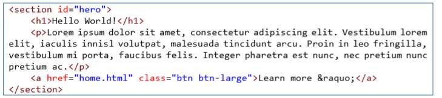
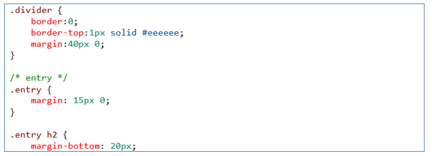

# Lab4Web
## Pratikum 4
### Nama        : Wayis Al Qorni TS
### Nim         : 312010169
### Kelas       : TI.20.A.1
### Mata Kuliah : Pemrograman Web

# Membuat Box Element dan CSS Float Property 
#### tambahkan kode untuk membuat box element dengan tag div seperti berikut.

#### Selanjutnya tambahkan deklarasi CSS pada head untuk membuat float element, seperti berikut. 

#### hasilnya akan menjadi seperti gambar di bawah ini:

# Mengatur Clearfix Element 
#### Clearfix digunakan untuk mengatur element setelah float element. Property clear digunakan untuk mengaturnya. 
#### Tambahkan element div lainnya seteleah div3 seperti berikut. 

#### Kemudian atur property clear pada CSS, seperti berikut. 

#### hasilnya akan menjadi seperti gambar di bawah ini:

# Membuat Layout Sederhana 
#### Kita akan membuat layout web sederhana seperti gambar berikut.

#### Buat folder baru dengan nama lab4_layout, kemudian buatlah file baru didalamnya dengan nama home.html, dan file css dengan nama style.css.

#### Kemudian buat kerangka layout dengan semantics element seperti berikut. 

#### Kemudian tulis kode berikut. 

#### hasilnya akan menjadi seperti gambar di bawah ini:

#### Kemudian tambahkan kode CSS untuk membuat layoutnya. 

#### hasilnya akan menjadi seperti gambar di bawah ini:

# Membuat Navigasi 
#### Kemudian selanjutnya mengatur navigasi.

#### hasilnya akan menjadi seperti gambar di bawah ini:

# Membuat Hero Panel
#### Tambahkan kode HTML dan CSS seperti berikut. 

#### Kode html

#### Kode CSS

#### hasilnya akan menjadi seperti gambar di bawah ini:

# Mengatur Layout Main dan Sidebar 
#### Selanjutnya mengatur main content dan sidebar, tambahkan CSS float.

# Membuat Sidebar Widget 
#### Kemudian selanjutnya menambahkan element lain dalam sidebar. 

#### Kode html

#### kode CSS

#### hasilnya akan menjadi seperti gambar di bawah ini:

# Mengatur Footer 
#### Selanjutnya mengatur tampilan footer. Tambahkan CSS untuk footer.

#### hasilnya akan menjadi seperti gambar di bawah ini:

# Menambahkan Elemen lainnya pada Main Content 
#### Kode html

#### Kode CSS

#### hasilnya akan menjadi seperti gambar di bawah ini:

# Menambahkan Content Artikel 
#### Selanjutnya membuat content artikel. Tambahkan HTML berikut pada main content. 

#### Kode html

#### Kode CSS

#### hasilnya akan menjadi seperti gambar di bawah ini:

